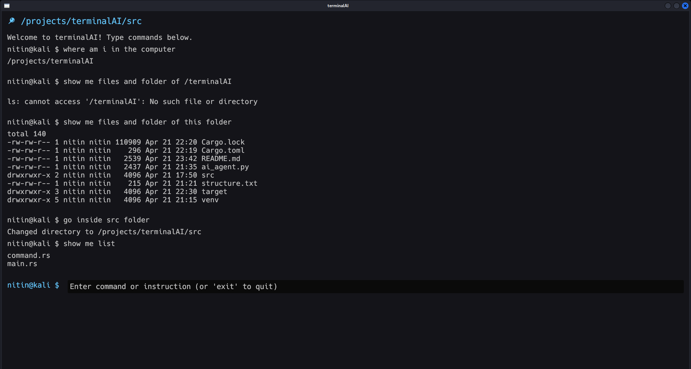

# TerminalAI: AI-Powered Terminal Assistant

<div align="center"> 

</div>

TerminalAI is an AI-driven terminal assistant that combines a sleek, dark-themed interface with natural language processing to transform plain English instructions into executable bash commands. Built with Rust for performance and Python for AI integration, it offers a modern workflow enhancement for developers.

## ✨ Features

- **Natural Language Processing**  
  Convert phrases like _"create a folder"_ to `mkdir folder`
- **Dark Futuristic GUI**  
  Responsive interface built with Rust's `eframe` featuring real-time typing
- **Smart Autocomplete**  
  Tab-complete files/directories with <kbd>Tab</kbd>
- **Direct Command Execution**  
  Run native bash commands (`pwd`, `ls --color`, `clear`, `cd`)
- **GPT-4 Integration**  
  Powered by Dockerized [FreeGPT4-WEB-API](https://github.com/d0ckmg/free-gpt4-web-api)
- **Robust Error Handling**  
  Clear diagnostics for API issues and invalid commands

## 🚀 Getting Started

### Prerequisites

- **Rust**:
  ```bash
  curl --proto '=https' --tlsv1.2 -sSf https://sh.rustup.rs | sh
  ```
- **Python 3.13+:**:

  ```bash
  sudo apt-get install python3 python3-pip python3-venv
  ```

- Install Docker

## Installation

- **Clome repo**:

  ```bash
  git clone https://github.com/nitindahiya-dev/terminalAI.git
  cd terminalAI
  ```

- **Set Up Python Environment**:

  ```bash
  python3 -m venv venv
  source venv/bin/activate
  pip install requests
  ```

- **Launch GPT-4 API**:

  ```bash
  docker run -p 5500:5500 d0ckmg/free-gpt4-web-api
  ```

- **Build Rust Project**:

  ```bash
  cargo build
  ```

- **Launching the Application**:
  ```bash
  # Ensure Docker API is running in background
  source venv/bin/activate
  cargo run -- --interactive
  ```

## 📚 Examples

- **Create Directory**:

  ```bash
  user@host $ create a logs folder
  → Executed: mkdir logs_folder
  ```

- **List Files with Colors**:

  ```bash
  user@host $ list files in detail
  → Executed: ls --color -l
  ```

- **System Command**:
  ```bash
  user@host $ clear
  → Terminal cleared
  ```

## 🔧 Troubleshooting

- **Verify AI agent path:**:

  ```bash
  /projects/terminalAI/venv/bin/python3 ai_agent.py "create folder"
  ```

  Expected output: {"command":"mkdir folder"}

- **❌ API Connection Issues**:

  ```bash
  docker ps
  netstat -tuln | grep 5500
  ```

- **🔄 UI Rendering Problems**:
  ```bash
  desired_width = 600.0,
  window_size = (800.0, 600.0)
  ```
